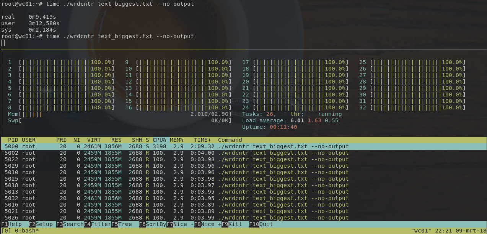

# wrdcntr - a fast word counter in Rust
This is a simple yet very fast word counter written in [Rust][rust].

The counter reads all text from a given file, counts all words,
and prints the number of occurrences for each word in alphabetical order.

All counting work is split across all CPU cores to count as quickly as possible,
and is done in a [map/reduce][mapreduce]-like manner.

Words contain any alpha numeric character, and are separated by any
non-alphanumeric character. Spaces, punctuation and so on are not counted.

The goal of this project is to show how powerful the Rust language can be with
minimal effort.

## Benchmark
Here are a basic (and not very accurate) benchmarks with files included in the
[`samples`](samples/) directory.

```
# 511KB with 115478 words
time wrdcntr samples/book.txt
# real    0m0,020s
# user    0m0,043s
# sys     0m0,001s

# 30MB with 7205401 words
time wrdcntr samples/many_books.txt
# real    0m0,731s
# user    0m2,290s
# sys     0m0,003s

# 35KB with 7074 words
time wrdcntr LICENSE
# real    0m0,003s
# user    0m0,006s
# sys     0m0,000s

```

These benchmarks are run on a machine running Linux with a
4-core i5-4670K @4.1Ghz CPU and 16GB RAM.

Counting files of 1GB is also fast, and nicely saturates all cores:



## Usage
To use the word counter, supply a file:
```bash
# Count words
wrdcntr samples/book.txt
```

Which outputs:

```
...
About: 12
Above: 1
Absolutely: 1
Actually: 1
Add: 1
Admiration: 1
Adrenaline: 1
After: 37
Again: 1
...
```

## Installation
For installation, the project must be compiled from source.
Git and Rust cargo are required.
Install the latest version of Rust with [rustup][rustup].

Then, clone and install `wrdcntr` with:

```bash
# Clone the project
git clone https://github.com/timvisee/wrdcntr.git
cd wrdcntr

# Install wrdcntr
cargo install -f

# Start using wrdcntr
wrdcntr --help

# or run it directly from Cargo
cargo run --release -- --help
```

Or just build and invoke the binary directly (Linux/macOS):

```bash
# Clone the project
git clone https://github.com/timvisee/wrdcntr.git
cd wrdcntr

# Build the project (release version)
cargo build --release

# Start using wrdcntr
./target/release/wrdcntr --help
```

## License
This project is released under the GNU GPL-3.0 license.
Check out the [LICENSE](LICENSE) file for more information.


[rust]: https://rust-lang.org/
[rustup]: https://rustup.rs/
[mapreduce]: https://en.wikipedia.org/wiki/MapReduce
